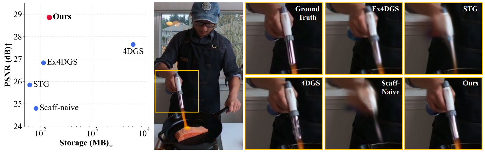
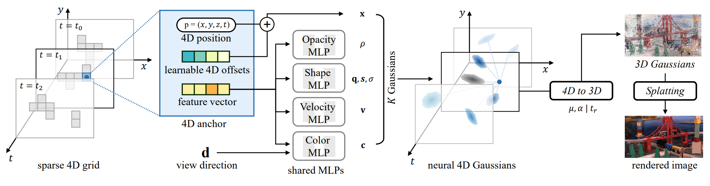

# 4D Scaffold Gaussian Splatting with Dynamic-Aware Anchor Growing for Efficient and High-Fidelity Dynamic Scene Reconstruction

[Woong Oh Cho](https://raikuma.github.io/), In Cho, Seoha Kim, Jeongmin Bae, Youngjung Uh, Seon Joo Kim <br />

[[`arxiv`](https://arxiv.org/abs/2411.17044)][[`project`](https://raikuma.github.io/4D-Scaffold-GS-Page/)]

> このREADMEは日本語版です。元の英語版READMEは [upstream (raikuma/4D-Scaffold-GS)](https://github.com/raikuma/4D-Scaffold-GS) を参照してください。

## 概要

「4D Scaffold Gaussian Splatting with Dynamic-Aware Anchor Growing for Efficient and High-Fidelity Dynamic Scene Reconstruction」の公式実装です。

<p align="center">

</p>

<p align="center">

</p>

## インストール

Ubuntu 20.04、CUDA 11.6のサーバーで動作確認しています。類似の構成であれば動作するはずですが、個別には検証していません。

1. このリポジトリをクローン:

```
git clone https://github.com/raikuma/4D-Scaffold-GS.git
cd 4D-Scaffold-GS
```

2. 依存関係をインストール

```
SET DISTUTILS_USE_SDK=1 # Windows only
conda env create --file environment.yml
conda activate 4d_scaffold
```

## データ

まず、プロジェクトディレクトリ内に```data/```フォルダを作成します。

```
mkdir data
```

N3DVデータセットの場合、データ構成は以下のようになります:

```
data/
├── N3DV/
│   ├── cook_spinach/
│   │   ├── images
│   │   │   ├── cam00_0000.png
│   │   │   ├── cam00_0001.png
│   │   │   ├── ...
│   │   ├── transforms_train.json
│   │   ├── transforms_test.json
│   │   ├── points3d.ply
│   ├── cut_roasted_beef/
│   │   ├── images
│   │   │   ├── cam00_0000.png
│   │   │   ├── cam00_0001.png
│   │   │   ├── ...
│   │   ├── transforms_train.json
│   │   ├── transforms_test.json
│   │   ├── points3d.ply
...
```

technicolorデータセットの場合は以下の通りです:

```
data/
├── technicolor_50/
│   ├── Birthday/
│   │   ├── images
│   │   │   ├── cam00
│   │   │   │   ├── 0000.png
│   │   │   │   ├── 0001.png
│   │   │   │   ├── ...
│   │   │   ├── cam01
│   │   │   │   ├── 0000.png
│   │   │   │   ├── 0001.png
│   │   │   │   ├── ...
│   │   ├── colmap
│   │   │   ├── dense
│   │   │   │   ├── workspace
│   │   │   │   │   ├── sparse
│   │   │   │   │   │   ├── cameras.bin
│   │   │   │   │   │   ├── images.bin
│   │   │   │   │   │   ├── points3D.bin
│   │   ├── points3D_downsample.ply
...
```

N3DVデータセットの前処理は[4DGS](https://github.com/fudan-zvg/4d-gaussian-splatting)の手順、technicolorデータセットの前処理は[E-D3DGS](https://github.com/JeongminB/E-D3DGS)の手順に従ってください。


## 学習

単一シーンを学習するには、```scripts/```フォルダ内の対応するスクリプトを実行します。例えば、N3DVデータセットの```cook_spinach```シーンを学習する場合:

```
bash ./scripts/train_n3dv.sh cook_spinach
```

このスクリプトは、ログ（実行時コードを含む）を```outputs/dataset_name/scene_name/exp_name/cur_time```に自動的に保存します。

## 評価

レンダリングと指標計算の処理は学習コードに統合済みです。そのため、学習が完了すると```rendering results```、```fps```、```quality metrics```が自動的に出力されます。レンダリング結果はログディレクトリに保存されます。```fps```は以下のようにおおまかに計測している点にご注意ください。

```
torch.cuda.synchronize();t_start=time.time()
rendering...
torch.cuda.synchronize();t_end=time.time()
```

これはオリジナルの3D-GSと多少異なる場合がありますが、分析には影響しません。

また、[3D-GS](https://github.com/graphdeco-inria/gaussian-splatting)の同等機能と同様の使い方で手動レンダリング機能も残しています。以下のように実行できます。

```
python render.py -m <path to trained model> # レンダリングを生成しfpsを計測
python metrics.py -m <path to trained model> # レンダリング結果の誤差指標を計算
```

## 連絡先

- Woong Oh Cho: wocho@yonsei.ac.kr

## 引用

この研究が役立った場合は、以下の引用をご検討ください:

```bibtex
@inproceedings{4dscaffoldgs,
  title={4D Scaffold Gaussian Splatting with Dynamic-Aware Anchor Growing for Efficient and High-Fidelity Dynamic Scene Reconstruction},
  author={Woong Oh Cho and In Cho and Seoha Kim and Jeongmin Bae and Youngjung Uh and Seon Joo Kim},
  booktitle={Arxiv},
  year={2025}
}
```

## LICENSE

[3D-GS](https://github.com/graphdeco-inria/gaussian-splatting)のLICENSEに従ってください。

## 謝辞

コードの大部分は**[Scaffold-GS](https://github.com/city-super/Scaffold-GS)**の優れた成果の上に構築されています。彼らの貢献に感謝します。

## このフォークでの変更点

上流（[raikuma/4D-Scaffold-GS](https://github.com/raikuma/4D-Scaffold-GS)）からフォークし、ヘッドレスサーバー（GUI/ディスプレイなしのDockerコンテナ、Python 3.7環境）で環境構築・N3DVデータセット学習を行う過程で発生したエラーに対応するため、以下を変更しています。

**2026-08-25**

- `environment.yml`
  - `defaults::pillow=9.4.0` / `defaults::libtiff=4.2.0` を明示的にピン留め。conda-forge由来のlibtiff（`.so.6`のみ提供）と、このPillowビルドが要求する`libtiff.so.5`のsoname不一致で`torchvision`のimportが失敗する問題への対処
  - `pip:`セクションに`jaxtyping`、`imagesize`を追加（コード実行時に必要だが記載が漏れていた依存パッケージ）
- `scene/dataset_readers.py`
  - `readNerfSyntheticInfo`内、`points3d.ply`が存在せずランダム初期点群にフォールバックする際の`BasicPointCloud(...)`呼び出しに、抜けていた`times=None`引数を追加（`TypeError: __new__() missing 1 required positional argument: 'times'`で学習開始前にクラッシュしていた）
- `scripts/train_n3dv.sh`
  - `num_workers`を`8`から`0`に変更。コンテナの`/dev/shm`が小さい（デフォルト64MB）環境で、DataLoaderのワーカープロセスが共有メモリ不足によりバスエラーで落ちる問題の回避策。`--shm-size`を十分な大きさ（例: 8GB以上）で確保できるコンテナ環境であれば、`8`に戻して問題ありません
